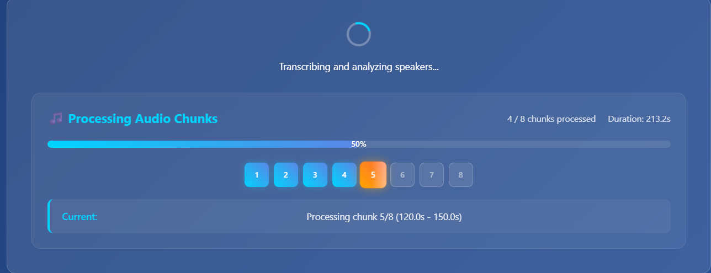
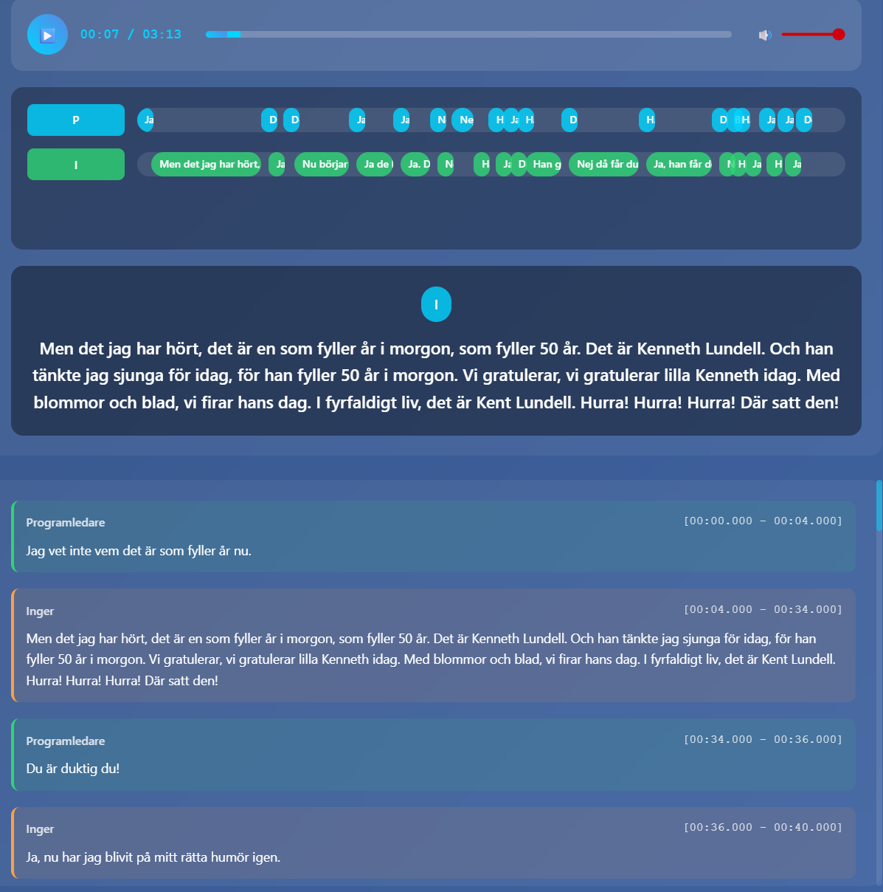

# Audio Scribe AI (KB-whisper + Pyannote)

A web application for audio transcription and speaker diarization using OpenAI Whisper variant KB-whisper (Swedish) and Pyannote.audio. Upload audio files or record directly in the browser to get timestamped transcriptions with speaker identification.
KB-Whisper info: https://huggingface.co/KBLab/kb-whisper-large
Everything runs locally.

Edit local_whisper_service.py to change model from kb-whisper-large (default)


## Features

- 🎙️ **Browser Recording**: Record audio directly in your browser
- 📁 **File Upload**: Support for multiple audio formats (MP3, WAV, M4A, FLAC, OGG, WebM)
- 🤖 **AI Transcription**: Powered by OpenAI Whisper, local Whisper models, or vLLM servers for accurate speech-to-text
- 🏠 **Local Processing**: Option to use local Whisper models for privacy and offline processing
- ⚡ **vLLM Support**: High-performance transcription via vLLM server with optimized inference
- 👥 **Speaker Diarization**: Automatic speaker identification using Pyannote.audio
- ✏️ **Editable Speaker Names**: Rename speakers from "Speaker 1, 2, 3..." to actual names
- ⏱️ **Timestamped Results**: Precise start/end times for each speaker segment
- 📤 **Export Options**: Download results as JSON or formatted Word documents (.docx)
- 📝 **Custom Templates**: Use your own Word templates to control document formatting
- 🎨 **Modern UI**: Clean, responsive interface with dark theme
- ⚡ **GPU Acceleration**: Automatic CUDA support for faster processing

## Screenshots

The application provides an intuitive interface matching the design shown in the project requirements, featuring:
- Recording controls with real-time duration display
- Drag-and-drop file upload area
- Speaker name editor with color-coded segments
- Scrollable transcription display with timestamps

<p float="left">
  
  <br>
  
</p>


## Installation

### Prerequisites

- Python 3.8 or higher
- CUDA-capable GPU (optional, but recommended for faster processing)
- FFmpeg installed on your system

### Setup

1. **Clone the repository**
   ```bash
   git clone <repository-url>
   cd kb-whisper-pyannote-transcription-diarization
   ```

2. **Install Python dependencies**
   ```bash
   pip install -r requirements.txt
   ```

3. **Install FFmpeg**
   
   **Windows:**
   - Download from https://ffmpeg.org/download.html
   - Add to PATH environment variable
   
   **macOS:**
   ```bash
   brew install ffmpeg
   ```
   
   **Linux:**
   ```bash
   sudo apt update
   sudo apt install ffmpeg
   ```

4. **Set up Pyannote.audio (optional)**
   
   For some Pyannote models, you may need to accept the user agreement and set up authentication:
   ```bash
   # Visit https://huggingface.co/pyannote/speaker-diarization-3.1
   # Accept the user agreement, then set your token:
   # Windows:
   copy .env-example .env
   # Linux/macOS:
   cp .env-example .env
   # Then edit .env and replace "YOUR HUGGING FACE TOKEN" with your actual token
   
   ```

## Usage

### Starting the Application

1. **Start the application**
   ```bash
   python run.py
   ```
   
   The server will start on `http://localhost:8000`

2. **Open your browser**
   
   Navigate to `http://localhost:8000` to access the application

### Using the Application

1. **Record Audio**
   - Click "Start Recording" to begin recording
   - Click "Stop Recording" when finished
   - The app will automatically process the recording

2. **Upload Audio File**
   - Drag and drop an audio file onto the upload area
   - Or click the upload area to browse for files
   - Supported formats: MP3, WAV, M4A, FLAC, OGG, WebM

3. **View Results**
   - Wait for processing to complete
   - Edit speaker names in the "Edit Speaker Names" section
   - View timestamped transcription with color-coded speakers
   - Export results as JSON or Word document using the Export buttons

### Exporting Results

The application supports two export formats:

1. **Export to Word**
   - Click "Export to Word" to download a formatted Word document (.docx)
   - Includes metadata, speaker labels, timestamps, and full transcription
   - Professional formatting with the ability to use custom templates
   - See [WORD_EXPORT_GUIDE.md](WORD_EXPORT_GUIDE.md) for template customization

2. **Export to JSON**
   - Click "Export JSON" to download raw transcription data
   - Includes all segments, timestamps, and speaker information
   - Useful for further processing or integration with other tools

**Setting up Word Export:**
```bash
# Run the setup script to initialize Word export
python setup_word_export.py
```

For detailed information on using custom Word templates, see [WORD_EXPORT_GUIDE.md](WORD_EXPORT_GUIDE.md).

## Configuration

### Environment Variables

You can customize the application behavior using environment variables:

```bash
# Whisper model size (tiny, base, small, medium, large)
export WHISPER_MODEL="base"

# Language for transcription (auto for auto-detection)
export WHISPER_LANGUAGE="auto"

# Pyannote model
export PYANNOTE_MODEL="pyannote/speaker-diarization-3.1"

# Speaker limits
export MIN_SPEAKERS="1"
export MAX_SPEAKERS="10"

# File size limit (bytes)
export MAX_FILE_SIZE="104857600"  # 100MB
```

### Local Whisper Configuration

For privacy and offline processing, you can use local Whisper models:

```bash
# Enable local Whisper
export WHISPER_USE_LOCAL=true

# Choose local model (Hugging Face format)
export WHISPER_LOCAL_MODEL_NAME="openai/whisper-base"

# Optional: path to local model files
export WHISPER_LOCAL_MODEL_PATH="/path/to/local/model"
```

**Available Local Models:**
- `openai/whisper-tiny`: 39MB, fastest processing
- `openai/whisper-base`: 74MB, good balance
- `openai/whisper-small`: 244MB, better accuracy
- `openai/whisper-medium`: 769MB, high accuracy
- `openai/whisper-large-v2`: 1.5GB, best accuracy
- `openai/whisper-large-v3`: 1.5GB, latest version

For detailed setup instructions, see [LOCAL_WHISPER_SETUP.md](LOCAL_WHISPER_SETUP.md).

### vLLM Server Configuration

For high-performance transcription, you can use a vLLM server with Whisper models:

```bash
# Enable vLLM (takes priority over local and OpenAI Whisper)
export WHISPER_USE_VLLM=true

# vLLM server configuration
export VLLM_BASE_URL="http://localhost:8000/v1"
export VLLM_API_KEY="token-abc123"
export VLLM_MODEL_NAME="openai/whisper-large-v3-turbo"
export VLLM_MAX_AUDIO_FILESIZE_MB="25"  # Maximum size per request
export VLLM_CHUNK_SIZE_MB="20"  # Auto-split files larger than this
```

**Setting up vLLM Server:**

1. Install vLLM with audio support:
   ```bash
   pip install vllm[audio]
   ```

2. Start vLLM server with a Whisper model:
   ```bash
   vllm serve openai/whisper-large-v3-turbo --api-key token-abc123
   ```

3. Configure your application to use vLLM by setting the environment variables above in your `.env` file.

**Benefits of vLLM:**
- Optimized inference performance with PagedAttention
- Compatible with OpenAI API format
- Supports multiple concurrent requests efficiently
- Can run on remote servers for distributed processing
- **Automatic chunking** for large audio files that exceed size limits

**Large File Handling:**

The application automatically splits large audio files into chunks when using vLLM:
- Files larger than `VLLM_CHUNK_SIZE_MB` are automatically split
- Each chunk is processed separately and results are merged
- Timestamps are automatically adjusted for seamless playback
- Configure chunk size based on your vLLM server's limits

**Note:** vLLM requires a CUDA-capable GPU for optimal performance.

### Model Selection

**Whisper Models:**
- `tiny`: Fastest, least accurate (~39 MB)
- `base`: Good balance of speed and accuracy (~74 MB)
- `small`: Better accuracy (~244 MB)
- `medium`: High accuracy (~769 MB)
- `large`: Best accuracy (~1550 MB)

**GPU Requirements:**
- Recommended: 4GB+ VRAM for base model
- Required: 8GB+ VRAM for large model

## API Endpoints

The application provides a REST API:

- `GET /` - Main application interface
- `POST /api/upload` - Upload audio file
- `POST /api/save-recording` - Save browser recording
- `POST /api/transcribe/{file_id}` - Transcribe and diarize audio
- `GET /api/health` - Health check

### Local Whisper Management

- `GET /api/whisper/status` - Get detailed Whisper service status
- `POST /api/whisper/switch-to-local` - Switch to local Whisper service
- `POST /api/whisper/switch-to-openai` - Switch to OpenAI Whisper service
- `POST /api/whisper/download-model` - Download a local Whisper model

## Project Structure

```
kb-whisper-pyannote-transcription-diarization/
├── backend/
│   ├── app.py                 # FastAPI main application
│   ├── services/
│   │   ├── audio_service.py   # Audio processing
│   │   ├── whisper_service.py # OpenAI Whisper integration
│   │   ├── local_whisper_service.py # Local Whisper integration
│   │   ├── vllm_whisper_service.py # vLLM server integration
│   │   ├── unified_whisper_service.py # Unified Whisper service
│   │   ├── pyannote_service.py# Pyannote integration
│   │   ├── pyannote_service_simple.py # Simple Pyannote service
│   │   ├── simple_diarization.py # Basic diarization
│   │   └── mock_services.py   # Mock services for testing
│   └── utils/
│       └── config.py          # Configuration settings
├── frontend/
│   ├── index.html            # Main application page
│   └── static/
│       ├── css/style.css     # Styling
│       └── js/
│           ├── app.js        # Main application logic
│           ├── karaoke-player.js # Karaoke-style playback
│           └── recorder.js   # Audio recording
├── screenshots/              # Application screenshots
├── requirements.txt          # Python dependencies
├── LOCAL_WHISPER_SETUP.md   # Local Whisper setup guide
└── README.md                # This file
```

## Troubleshooting

### Common Issues

1. **"Recording not supported"**
   - Ensure you're using HTTPS or localhost
   - Check browser permissions for microphone access

2. **"Pyannote pipeline not available"**
   - Check if you need to accept the model's user agreement
   - Verify HUGGINGFACE_TOKEN if required

3. **Slow processing**
   - Consider using a smaller Whisper model
   - Ensure CUDA is properly installed for GPU acceleration

4. **FFmpeg errors**
   - Verify FFmpeg is installed and in PATH
   - Check audio file format compatibility

### Performance Tips

- Use GPU acceleration when available
- Choose appropriate Whisper model size for your hardware
- Limit audio file length for faster processing
- Use WAV format to skip conversion step

## Development

### Running in Development Mode

```bash
# For development with auto-reload
cd backend
uvicorn app:app --reload --host 0.0.0.0 --port 8000

# Or use the main entry point (recommended)
python run.py

# The frontend is served by FastAPI
```

### Adding New Features

The application is designed to be easily extensible:
- Add new audio formats in `audio_service.py`
- Implement additional export formats
- Add real-time processing updates
- Integrate additional AI models

## License

This project is open source and available under the MIT License.

## Contributing

Contributions are welcome! Please feel free to submit a Pull Request.
